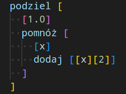
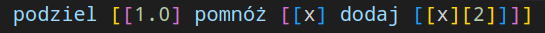

# Jak okiełznać wszechobecne nawiasy?

Zarówno składnia Lispu ([S-wyrażenia](https://pl.wikipedia.org/wiki/S-wyra%C5%BCenie)) jak i składnia Szczebiotu ([Jevko](jevko.org)) charakteryzują się ekstremalnym minimalizmem i jednorodnością. 

Niesie to ze sobą wiele zalet, takich jak prostota, regularność i elastyczność tych języków i ich implementacji.

Z drugiej strony brak składniowego zróżnicowania może początkowo sprawiać problemy w pisaniu i czytaniu kodu, szczególnie jeśli jesteśmy przyzwyczajeni do bardziej heterogenicznych języków programowania.

Z pewnością narzeka na to wielu początkujących użytkowników Lispu, nawet zniechęcając się i porzucając przez to dalszą eksplorację tej wspaniałej minimalistycznej rodziny języków programowania.

Jest to zjawisko po części uzasadnione pewną niekonwencjonalnością zarówno składniową i stylistyczną Lispu, której m.in. ze względów historycznych nie da się zmienić.

Jednym z oryginalnych powodów powstania Jevko jest chęć zaprojektowania składni zachowującej minimalizm i regularność S-wyrażeń, która jednocześnie jest wolna od tych technicznych i historycznych ograniczeń.

Jevko może być więc postrzegane jako udoskonalona, przyjaźniejsza potencjalnie większej liczbie użytkowników, wersja S-wyrażeń.

Omówimy tutaj mniej lub bardziej subtelne szczegóły, które za to odpowiadają, jak również podamy wskazówki stylistyczne i techniczne pozwalające na dalszą redukcję wyżej opisanego problemu.

## Wprowadzenie

W przeciwieństwie do Lispu:

* Szczebiot używa nawiasów kwadratowych `[]` zamiast okrągłych `()`, m.in. z uwagi na ergonomię -- wymagają dwa razy mniej wciśnięć klawiszy,

* w Szczebiocie operator występuje **przed** nawiasem otwierającym listę (drzewo) argumentów, a więc podobnie jak notacja wywołań funkcji w większości języków programowania i w matematyce. A więc wywołanie funkcji `f` z argumentem `x`, które zapisujemy w Lispie jako:

```
(f x)
```

w Szczebiocie wygląda tak:

```
f [x]
```

* w Szczebiocie spacje nie służą do oddzielania argumentów funkcji -- zamiast tego ujmuje się je w nawiasy. A więc wywołanie funkcji `f` z argumentami `x` i `y`, które zapisujemy w Lispie jako:

```
(f x y)
```

w Szczebiocie wygląda tak:

```
f [[x][y]]
```

Ze względu na to, Szczebiot co prawda wymaga używania jeszcze większej liczby nawiasów niż Lisp, m.in. dlatego zwrócona jest uwaga na ergonomię ich wpisywania. W zamian za to, składnia (i parser) jest jeszcze prostsza i dozwolone jest (!) używanie naturalnych (tj. zawierających spacje) nazw dla identyfikatorów składających się z wielu słów, np. możemy nazwać funkcję `liczba Fibonacciego` zamiast uciekać się do `liczba-Fibonacciego`/`liczba_Fibonacciego`/`liczbaFibonacciego`, itp. Np. w Lispie bylibyśmy zmuszeni napisać:

```
(liczba-Fibonacciego 5)
```

natomiast w Szczebiocie możemy napisać:

```
liczba Fibonacciego [5]
```

Należy tu zwrócić uwagę, że białe znaki **wokół** identyfikatorów nie są brane pod uwagę jako ich część, a więc następujący kod jest równoważny poprzedniemu:

```

   liczba Fibonacciego[5]

   
```

Nb. alternatywnie moglibyśmy zrezygnować z tej funkcjonalności i zaprojektować nasz język, tak jak w Lispie używając spacji do oddzielania argumentów -- wówczas liczba nawiasów w obu językach byłaby taka sama. Jednakże być może większym problemem jest nie liczba, a właśnie rozmieszczenie nawiasów.

A na to możemy zastosować kolejny środek.

## Styl

Być może jednym z powodów przeważającej popularności składni języków z rodziny C nad Lispowymi jest ich czytelniejsza konwencja rozmieszczania nawiasów.

Tę właśnie konwencję więc zaleca się stosować pisząc kod w Szczebiocie.

Na przykład następującą linię kodu w Lispie:

```
(podziel 1.0 (pomnóż x (dodaj x 2)))
```

zapisalibyśmy zgodnie z lispową konwencją czytelniej w kilku liniach jako:

```
(podziel 1.0 
  (pomnóż x 
    (dodaj x 2)))
```

Natomiast w języku z rodziny C wyglądałoby to w ten sposób:

```
podziel(
  1.0,
  pomnóż(
    x,
    dodaj(x, 2)
  )
)
```

Różnica polega na tym, że tutaj używamy nowej linii **po** nawiasie otwierającym i wstawiamy taką również przed pasującym nawiasem zamykającym, który powinien być na tym samym poziomie wcięcia, co otwierający.

Pozwala to uniknąć "zbierania się" zagnieżdżonych nawiasów zamykających w tej samej linii. Poprawia to znacznie czytelność kodu, kosztem nieco mniejszej zwięzłości w pionie.

Zgodnie z powyższym zaleceniem powyższy kod zapiszemy w Szczebiocie jako:

```
podziel [
  [1.0]
  pomnóż [
    [x]
    dodaj [[x][2]]
  ]
]
```

## Odpowiedni edytor kodu

Kolejnym sposobem na ułatwienie pracy z wieloma zagnieżdżonymi nawiasami byłoby użycie edytora kodu, który ułatwia ich odróżnienie przez zróżnicowane kolorowanie składni, tak jak to działa na przykład w najnowszych wersjach [Visual Studio Code](https://code.visualstudio.com/). Wówczas powyższy kod wyglądałby tak:



Z taką pomocą czytanie nawet mniej stylistycznego kodu jest łatwiejsze. Np. porównajmy ten sam kod w jednej linii:

```
podziel [[1.0] pomnóż [[x] dodaj [[x][2]]]]
```

z jego pokolorowaną wersją:



Kolejne udogodnienia, które może zapewnić nam edytor kodu to automatyczne formatowanie składni, podświetlanie pasujących nawiasów czy skakanie pomiędzy pasującymi nawiasami.

Można sobie wyobrazić również rozmaite rozszerzenia w stylu np. [paredit](https://paredit.org/), pozwalające na nawigację i zaawansowane operacje na drzewach składni, których implementacja dla Jevko nie byłaby z pewnością trudniejsza niż dla S-wyrażeń.
