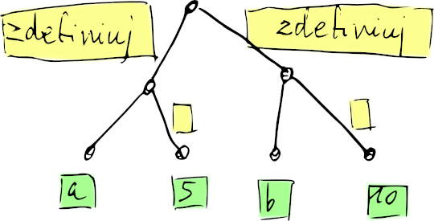
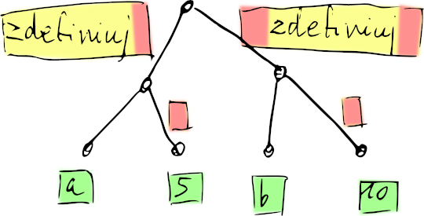

# Jak stworzyć swój własny język programowania?

To repozytorium zawiera zabawkowy język programowania "Szczebiot" stworzony w celach edukacyjnych.

## Uwaga

Szczebiot jest przykładem użycia [Jevko](jevko.org) (czytane podobnie jak "drzewko") jako składni języka programowania. Warto przy okazji podkreślić, że Jevko samo w sobie nie jest językiem programowania, a uniwersalną notacją do zapisu wszelkiego rodzaju struktur drzewiastych. Jevko nadaje się nie tylko jako podstawa do definicji języków programowania, ale również do definiowania formatów danych, konfiguracji, znaczenia tekstu, i innych bardziej lub mniej specjalistycznych zastosowań.

Jevko w zamyśle jest czytelną dla człowieka składnią uniwersalną, która ma ułatwiać komunikację pomiędzy różnymi językami programowania i środowiskami -- zaprojektowaną jako podstawa do maksymalnego uproszczenia i zunifikowania składni i formatów takich jak XML, JSON, YAML, czy HTML. Niezależnie jednak od praktycznej realizowalności tego celu, Jevko ma również wartość jako prosty element budulcowy wyspecjalizowanego oprogramowania, jako narzędzie pomagające w projektowaniu i myśleniu, czy jako narzędzie dydaktyczne, jak obrazuje niniejszy przykład.

## Moduły składające się na Szczebiot

W możliwie najmniejszej liczbie linii kodu zaimplementowany jest tutaj:

* [Parser](parser.mjs) oparty na [Jevko](jevko.org) -- przekształca kod źródłowy w języku Szczebiot z ciągu znaków w drzewo składniowe. Na przykład taki ciąg znaków: 

```
zdefiniuj [[a] [5]]
zdefiniuj [[b] [10]]
```

przekształca się w takie drzewo:



Na żółto zaznaczono tutaj etykiety krawędzi, na zielono zaś etykiety węzłów.

* [Przycinak](przycinak.mjs) pokazuje bardzo prostą rekurencyjną transformację drzewa składniowego -- usuwa gałązki oznaczone jako `komentarz` i przycina spacje na końcówkach etykiet. Na przykład w powyższym drzewie przycinane są części zaznaczone na czerwono:



* [Szczebiot](szczebiot.mjs) -- interpreter języka Szczebiot. Używa parsera i przycinaka, żeby uzyskać drzewko nadające się do bezpośredniej interpretacji -- wykonania jako program.

* [Demo](demo.mjs) -- demonstruje użycie interpretera na przykładzie prostego programu w języku Szczebiot.

Do uruchomienia demo wymagane jest posiadanie środowiska [Node.js](https://nodejs.org/en). Jeśli mamy je zainstalowane, możemy uruchomić demo z linii komend w ten sposób:

```
node demo.mjs
```

## Cechy

Cechy języka Szczebiot:

* bardzo prosta i regularna składnia, dzięki [Jevko](jevko.org)
* wbudowane konstrukcje języka są nazwane polskimi słowami
* parser i interpreter napisany w języku JavaScript, z nazwami funkcji i zmiennych w języku polskim

## Przekształcanie kodu źródłowego w uruchomiony program -- etapy

Implementację języka Szczebiot można podzielić na trzy etapy:

1. Parsowanie -- analiza składniowa
2. Przycinanie -- przygotowanie do interpretacji
3. Interpretacja

## Składnia

Składnia języka Szczebiot opiera się na Jevko i przypomina składnię języków z [rodziny Lisp](https://pl.wikipedia.org/wiki/Lisp). W porównaniu do Lispu, Szczebiot jest jeszcze bardziej regularny i minimalistyczny.

Podobnie jak w Lispach, operacje i wywołania funkcji w Szczebiocie są zapisywane przy pomocy [notacji polskiej](https://pl.wikipedia.org/wiki/Notacja_polska) z nawiasami: operator poprzedza argumenty, kolejność wykonywania działań zawsze od lewej do prawej, z uwzględnieniem zagnieżdżenia nawiasów.

W przeciwieństwie do Lispu:

* Szczebiot używa nawiasów kwadratowych `[]` zamiast okrągłych `()`, m.in. z uwagi na ergonomię -- wymagają dwa razy mniej wciśnięć klawiszy,

* w Szczebiocie operator występuje **przed** nawiasem otwierającym listę (drzewo) argumentów (a więc podobnie jak notacja wywołań funkcji w większości języków programowania i w matematyce). A więc wywołanie funkcji `f` z argumentem `x`, które zapisujemy w Lispie jako:

```
(f x)
```

w Szczebiocie wygląda tak:

```
f [x]
```

* w Szczebiocie spacje nie służą do oddzielania argumentów funkcji -- zamiast tego ujmuje się je w nawiasy. A więc wywołanie funkcji `f` z argumentami `x` i `y`, które zapisujemy w Lispie jako:

```
(f x y)
```

w Szczebiocie wygląda tak:

```
f [[x][y]]
```

Ze względu na to, Szczebiot wymaga używania jeszcze większej liczby nawiasów niż Lisp, m.in. dlatego zwrócona jest uwaga na ergonomię ich wpisywania ([więcej na ten temat](NAWIASY.md)). W zamian za to, składnia (i parser) jest jeszcze prostsza i dozwolone jest (!) używanie naturalnych (tj. zawierających spacje) nazw dla identyfikatorów składających się z wielu słów, np. możemy nazwać funkcję `liczba Fibonacciego` zamiast uciekać się do `liczba-Fibonacciego`/`liczba_Fibonacciego`/`liczbaFibonacciego`, itp. Np. w Lispie bylibyśmy zmuszeni napisać:

```
(liczba-Fibonacciego 5)
```

natomiast w Szczebiocie możemy napisać:

```
liczba Fibonacciego [5]
```

Należy tu zwrócić uwagę, że białe znaki **wokół** identyfikatorów nie są brane pod uwagę jako ich część, a więc następujący kod jest równoważny poprzedniemu:

```

   liczba Fibonacciego[5]

   
```

<!-- Ten minimalizm i elastyczność składniową Szczebiot zawdzięcza zastosowaniu [Jevko](jevko.org) jako podstawy swojej składni. -->

Język Szczebiot korzysta z jednolitości składniowej Jevko i używa wyżej opisanej notacji zarówno przy wywoływaniu funkcji zdefiniowanych przez użytkownika jak i konstrukcji wbudowanych w język. Szablon tej notacji można zapisać jako:

```
<nazwa operacji> [<drzewko argumentów>]
```

Sekwencja takich wywołań:

```
<nazwa operacji 1> [<drzewko argumentów 1>]
<nazwa operacji 2> [<drzewko argumentów 2>]
<nazwa operacji 3> [<drzewko argumentów 3>]
<...>
```

stanowi poprawny program w języku Szczebiot. 

<!-- put under <details>? -->

Drzewka argumentów również są takimi sekwencjami wywołań, a więc możemy rozwinąć `<nazwa operacji 1> [<drzewko argumentów 1>]` do:

```
<nazwa operacji 1> [
  <nazwa operacji 1.1> [<drzewko argumentów 1.1>]
  <nazwa operacji 1.2> [<drzewko argumentów 1.2>]
  <nazwa operacji 1.3> [<drzewko argumentów 1.3>]
  <...>
]
```

i tak samo `<nazwa operacji 2> [<drzewko argumentów 2>]` itd.

Taką samą strukturę mają ciała [funkcji](#funkcja) zdefiniowanych przez użytkownika czy [bloków](#blok) kodu.

Słowem, wszystkie konstrukcje składniowe są drzewami o identycznej strukturze. Jedyne co odróżnia elementy wbudowane od zdefiniowanych przez użytkownika to ich nazwy.

W składni Szczebiotu istnieją tylko dwa symbole, które nadają programom drzewiastą strukturę: nawiasy kwadratowe `[` i `]`.

## Składnia i co dalej?

Skoro składnia jest jednolita, to skąd bierze się różnica w interpretacji elementów wbudowanych i zdefiniowancyh przez użytkownika? 

Odpowiedź tkwi w semantyce -- zdefiniowanym z góry znaczeniu, które nasz język nadaje rozmaitym elementom składniowym. W Szczebiocie te elementy są identyfikowane przez nazwy (a nie znaki interpunkcyjne, etc.).


<!-- todo: o niekoniecznych elementach językowych komplikujących (czasem bezpowrotnie) inne języki, zaletach i wadach; złotym środku minimalizmu; ekstrema: APL? Perl? PHP? C? Lisp? BLC -->

## Semantyka

Semantyka to zasady, które określają znaczenie poszczególnych elementów składniowych.

Semantyka określa wartość, kroki i sposób jej obliczania dla każdego elementu składniowego.

Dzięki niej możliwy jest proces interpretacji, który niejako "ożywia" statyczne drzewo składni, które staje się działającym programem.

Żeby to zrozumieć, kluczowe jest pojęcie, które nazywam tu *kontekstem* (w anglojęzycznej literaturze mówi się na to *environment*, czyli *środowisko*).

### Konteksty

Kontekst jest elementem niejawnym, niewidocznym w kodzie źródłowym programu. Bez pojęcia kontekstu jednak interpretacja nie byłaby możliwa.

Kontekst bowiem zawiera wartości wszystkich zmiennych i operacji dostępnych w danym momencie działania programu.

Kontekst można sprowadzić do prostego słownika (i tak jest Szczebiocie zaimplementowany), czyli kolekcji klucz-wartość. Kluczami w kontekście są właśnie nazwy dostępnych zmiennych i operacji.

W każdym momencie działania programu dostępny jest *jakiś* kontekst.

Konteksty są tworzone i niszczone przez wywołania funkcji lub bloków kodu.

Każdy nowy kontekst posiada kontekst-rodzica, z jednym wyjątkiem, którym jest specjalny kontekst początkowy.

Kontekst początkowy zawiera definicje wszystkich operacji i zmiennych wbudowanych w język -- dzięki niemu możliwe jest zainicjowanie procesu interpretacji.

### Programy, bloki, i funkcje

Jeśli program/funkcja/blok nie zawiera pętli nieskończonej, jego/jej wartością jest wartość ostatniego wywołania.

Przykład:

```
odejmij [[8][4]]
pomnóż [[2][2]]
podziel [[10][5]]
```

Mamy tu program zawierający trzy wywołania, które będą wykonane po kolei. Wartości dwóch pierwszych wywołań "przepadają", a zwracana jest jedynie wartość ostatniego.

Tak samo dzieje się jeśli seria wywołań jest ujęta w blok:

```
blok [
  odejmij [[8][4]]
  pomnóż [[2][2]]
  podziel [[10][5]]
]
```

Wartością bloku jest wartość ostatniego wywołania.

Podobnie w przypadku [funkcji](#funkcja). Jeśli [zdefiniujemy](#zdefiniuj) funkcję `f`, której ciałem jest taka sama seria wywołań jak powyżej:

```
zdefiniuj [[f] funkcja [[]
  odejmij [[8][4]]
  pomnóż [[2][2]]
  podziel [[10][5]]
]]
```

a następnie wywołamy tę funkcję:

```
f []
```

Zwrócona zostanie wartość ostatniego wywołania.

### Argumenty

Z punktu widzenia składniowego, lista argumentów wygląda identycznie jak ciało programu/funkcji/bloku -- jest ciągiem wywołań.

Jednak semantyka jest inna.

Mianowicie, poczas interpretacji listy argumentów, wszystkie wartości po kolei są przyporządkowywane do nazw parametrów i przekazywane do kontekstu wywoływanej operacji.

Na przykład jeśli zdefiniujemy funkcję `różnica kwadratów`:

```
zdefiniuj [[różnica kwadratów] funkcja [[[a][b]]
  odejmij [
    pomnóż [[a][a]]
    pomnóż [[b][b]]
  ]
]]
```

I wywołamy ją z argumentami `5` i `10`:

```
różnica kwadratów [[5][10]]
```

wartości `5` i `10` zostaną przyporządkowane do nazw `a` i `b` w nowo utworzonym kontekście lokalnym naszej funkcji.

## Opis elementów wbudowanych

### komentarz

Gałęzie opisane jako `komentarz` służą do zamieszczania czytelnych dla ludzi komentarzy. Są one usuwane przed interpretacją, na etapie przycinania drzewka. Nie trafiają w ogóle do interpretera, więc nie liczą się jako wywołania.

### pusty operator

Przyjmuje jeden argument i zwraca jego wartość.

Przykład:

```
['hello world]
```

### prawda i fałsz

Wartości odpowiadające `true` i `false` w JavaScripcie. Zwracane przez operatory [porównania](#porównania-malejące-rosnące-równe).

### zdefiniuj

Schemat:

```
zdefiniuj [[<nazwa>] [<wartość>]]
```

Przykład:

```
zdefiniuj [[osiem] pomnóż [[2][4]]]
```

### zmień!

Schemat:

```
zmień! [[<nazwa>] [<wartość>]]
```

Przykład:

```
zdefiniuj [[a] [5]]
zmień! [[a] [10]]
```

### funkcja

Schemat:

```
funkcja [[<parametry funkcji>]
  komentarz [kolejne operacje stanowią ciało funkcji:]
  <nazwa operacji 1> [<drzewko argumentów 1>]
  <nazwa operacji 2> [<drzewko argumentów 2>]
  <nazwa operacji 3> [<drzewko argumentów 3>]
  <...>
]
```

Przykład:

```
zdefiniuj [[dodaj 4] funkcja [[x]
  dodaj [[x][4]]
]]
```

### blok

Konstrukcja służąca do grupowania wywołań. 

Schemat:

```
blok [
  <nazwa operacji 1> [<drzewko argumentów 1>]
  <nazwa operacji 2> [<drzewko argumentów 2>]
  <nazwa operacji 3> [<drzewko argumentów 3>]
]
```

Przykład:

```
blok [
  szczebiocz ['zwracam 4']
  [4]
]
```

<!-- Wartością -->

### warunkowo

Uogólniona wersja konstrukcji `if`, służącej do wykonywania fragmentów kodu tylko, jeśli jakiś warunek jest spełniony, z możliwością podania alternatywy w przeciwnym wypadku.

Odpowiada Lispowej konstrukcji `cond`, z tym, że w Szczebiocie składnia jest nieco uproszczona, redukując liczbę niepotrzebnych nawiasów.

Schemat tej konstrukcji jest następujący:

```
warunkowo [
  [<warunek 1>] [<kod 1>]
  [<warunek 2>] [<kod 2>]
  [<warunek 3>] [<kod 3>]
  <...>
  [<opcjonalny kod alternatywy>]
]
```

Każdy warunek musi być wywołaniem zwracającym wartość `prawda` lub `fałsz`.

Warunki są sprawdzane po kolei, aż do znalezienia takiego, który zwraca wartość `prawda`. W takim wypadku wykonywany jest kod następujący po warunku; reszta warunków nie jest sprawdzana i żaden inny kod nie jest wykonywany.

Jeśli żaden z warunków nie zwraca wartości `prawda` i jest dostępny jest kod alternatywy, jest on wykonywany.

Należy zaznaczyć, że jeśli chcemy użyć więcej niż jednego wywołania w kodzie warunku lub alternatywy, należy te wywołania ująć w `blok`.

Przykład:

```
warunkowo [
  równe? [[a][0]] blok [
    szczebiocz ['a wynosi 0']
    [b]
  ]
  równe [[a][1]] blok [
    szczebiocz ['a wynosi 1']
    pomnóż [[b][2]]
  ]
  blok [
    szczebiocz ['a nie jest ani zerem ani jedynką']
    pomnóż [[b][3]]
  ]
]
```

### arytmetyka: dodaj, odejmij, pomnóż, podziel

Schemat:

```
<operacja arytmetyczna> [<wartości liczbowe>]
```

Przykłady:

```
dodaj [[2][2]]
pomnóż [[3][5][8]]
podziel [[100][2][5][2]]
```

### porównania: malejące?, rosnące?, równe?

Schemat:

```
<operacja porównania> [<wartości liczbowe>]
```

Przykłady:

```
malejące? [[5][10][15]]    komentarz [-> fałsz]
rosnące? [[5][10][15]]     komentarz [-> prawda]
równe? [[5][10][15]]       komentarz [-> fałsz]
```

## Możliwość dalszego rozszerzenia

Możemy dalej rozszerzać nasz język -- dzięki temu, że jest interpretowany w JavaScripcie, bardzo łatwo "udostępniać" w Szczebiocie dowolne funkcjonalności JavaScriptu, implementując je jako kolejne wbudowane operacje.

Nasze wbudowane operacje mogą też rozszerzać możliwości JavaScriptu, np. podstawowe funkcje arytmetyczne w Szczebiocie są wariadyczne (przyjmują dowolną liczbę argumentów), w przeciwieństwie do JavaScriptu, gdzie operatory artymetyczne, za pomocą których nasze wbudowane funkcje implementujemy, zawsze przyjmują dwa argumenty.

<!-- Możemy również wymyślać oryginalne konstrukcje składniowe, -->

<!-- ## Konstrukcja parsera

## Konstrukcja interpretera -->

## Dalsze eksploracje

Szczebiot jest uproszczoną i spolszczoną wersją eksperymentalnego języka [Jevkalk](https://github.com/jevko/jevkalk), również opartego o [Jevko](jevko.org).

Zainteresowanym zrozumieniem szczegółów implementacji języków w stylu Lispu polecam (anglojęzyczną) książkę [Structure and Interpretation of Computer Programs (SICP)](https://en.wikipedia.org/wiki/Structure_and_Interpretation_of_Computer_Programs), której wiele wersji jest dostępnych również za darmo online, np. [interaktywna wersja tutaj](https://xuanji.appspot.com/isicp/).

Dla ekstremalnych minimalistów, którym wyżej opisany interpreter wydaje się zbyt złożony, załączam poniżej kod interpretera jednego z najbardziej minimalistycznych języków programowania, czyli [rachunku lambda](https://pl.wikipedia.org/wiki/Rachunek_lambda):

```js
const exec = (exp, args = [], env = []) => {
  while (true) {
    const first = exp[0]
    const second = exp[1]
    if (first === 'T') {
      if (env.length === 0) throw Error('environment empty');
      [exp, env] = env[0]
    }
    else if (first === 'S') {
      if (env.length === 0) throw Error('environment empty');
      exp = second
      env = env[1]
    }
    else if (first === 'L') {
      if (args.length === 0) return [exp, env]
      env = [args[0], env]
      args = args[1]
      exp = second
    }
    else if (first === 'A') {
      exp = second[0]
      args = [[second[1], env], args]
    } else throw Error('exp' + exp)
  }
}
```

Dokładniej mówiąc, jest to interpreter języka LAST, który jest uproszczonym wariantem rachunku lambda, opartym na innym minimalistycznym wariancie zwanym [BLC](https://tromp.github.io/cl/cl.html).

Zainteresowanych szczegółami odsyłam do artykułu [Introduction to the LAST programming language](https://xtao.org/blog/last-intro.html), ew. [wersji polskiej tegoż wygenerowanej przez Google Translate](https://xtao-org.translate.goog/blog/last-intro.html?_x_tr_sl=en&_x_tr_tl=zh-TW&_x_tr_hl=en) -- można znaleźć tam więcej interesujących linków.

I jeszcze dwa interesujące (anglojęzyczne) linki na koniec:

* Subreddit [/r/ProgrammingLanguages](https://www.reddit.com/r/ProgrammingLanguages/) skupiający społeczność twórców języków programowania,
* [Esolang wiki](https://esolangs.org/wiki/Main_Page) -- encyklopedia ezoterycznych (minimalistycznych, unikalnych, trudnych w użyciu, dziwnych) języków programowania.

Happy Coding!